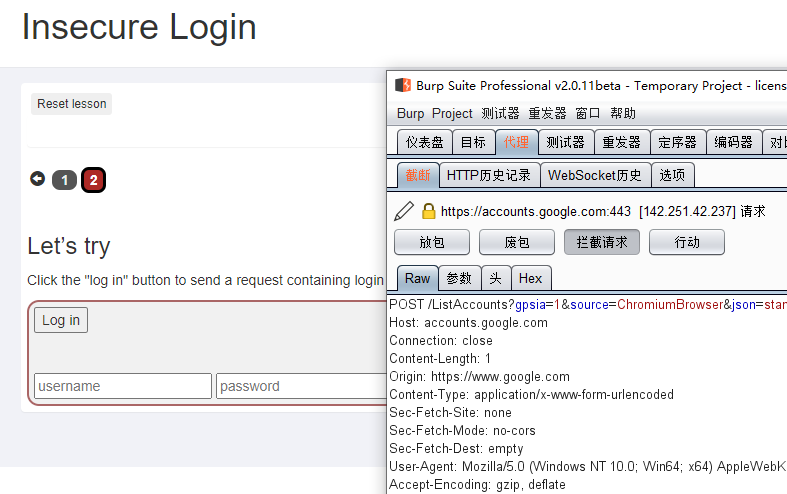
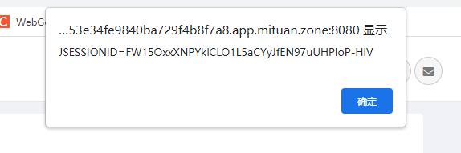
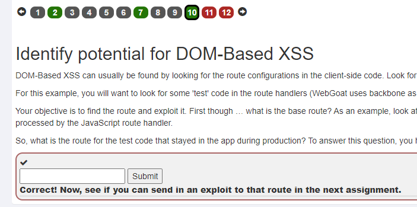

# Web 应用漏洞攻防

## 实验目的

- 了解常见 Web 漏洞训练平台；
- 了解 常见 Web 漏洞的基本原理；
- 掌握 OWASP Top 10 及常见 Web 高危漏洞的漏洞检测、漏洞利用和漏洞修复方法；

## 实验环境

- WebGoat
- Juice Shop

## 实验要求

- [ ] 每个实验环境完成不少于 **5** 种不同漏洞类型的漏洞利用练习；
- [ ] （可选）使用不同于官方教程中的漏洞利用方法完成目标漏洞利用练习；
- [ ] （可选）**最大化** 漏洞利用效果实验；
- [ ] （可选）编写 **自动化** 漏洞利用脚本完成指定的训练项目；
- [ ] （可选）定位缺陷代码；
- [ ] （可选）尝试从源代码层面修复漏洞；

## 实验过程

我发现了一个网站，该站点提供了覆盖各种漏洞类型的一站式靶机解决方案，无需在本地搭建各种靶机环境，可以直接在这里进行渗透测试的学习以及演练：[MiTuan](https://mituan.zone/#/account/login)

登录MiTuan，搜索需要的靶机环境，点击立即创建后再点击开始练习即可


### WebGoat


打开靶机，等待环境搭建，进入登录界面，注册登录：

> 账号：aaaaaa
>
> 密码：123456


#### (A1) SQL Injection (intro)

1. 检索员工Bob Franco的部门。请注意，您已被授予此分配中的完全管理员权限，并且可以在不进行身份验证的情况下访问所有数据

   

   输入sql语句：

   > SELECT department FROM employees WHERE first_name = 'Bob'

   

2. 尝试将 Tobi Barnett 的部门更改为“销售”。请注意，您在此任务中已被授予完全管理员权限，无需身份验证即可访问所有数据。

   输入sql语句：

   > update employees set department='Sales' where first_name='Tobi'

   

3. 现在尝试通过将列“phone”(varchar(20)) 添加到表“employees”来修改模式。：

   输入sql语句：

   > alter table employees add column phone varchar(20)

   

4. 尝试将表`grant_rights`的权限授予用户`unauthorized_user`：

   输入sql语句：

   > grant all on grant_rights to unauthorized_user

   

5. 尝试使用下面的表单从用户表中检索所有用户。您不需要知道任何特定的用户名即可获得完整列表。

   

6. 根据上面的sql语句构造下，由于没有单引号包裹，使用不用单引号闭合，直接给出or 1=1即可

   

7. 根据sql语句，可以看到用单引号包裹了，这里闭合掉再加上我们的'or 1=1 -- -，后面再注释掉即可

   

8. 我们要修改金额，直接闭合然后构造语句再把后面注释掉，从而让我们的金额成为最多

   > '; update employees set salary=9999999 where last_name='Smith';-- -
   >
   > 1

   

9. 现在，您是公司中收入最高的人。但是你看到了吗？似乎有一个access_log表，您的所有操作都已记录到其中！最好在任何人注意到之前完全删除它。

   直接删除表即可

   > '; drop table access_log;-- -

   

#### (A2)Broken Authentication (Secure Passwords)

1. 输入一个足够安全的密码即可

   

#### (A3)Sensitive Data Exposure (Insecure Login)

单击“登录”按钮以发送包含其他用户登录凭据的请求。然后，将这些凭据写入相应的字段并提交以确认。尝试使用数据包嗅探器拦截请求。

1. 打开代理服务器，开启burp suite抓包

   

2. 点击 log in，通过截获用户没有在前端加密的密码，直接拿到用户名+密码

   > CaptainJack
   >
   > BlackPearl

   


#### (A5)Broken Access Control (Missing Function Level Access Control)

1. f12检查网页，可以找到隐藏内容如下：

   

2. 输入即可通过：

   

3. 根据上一题的信息收集，我们得知了/users与/config链接，但是我直接访问IP/WebGoat/users没有任何可用的信息，需要在请求/users时把content-type改为application/json

   访问

   http://623229a953e34fe9840ba729f4b8f7a8.app.mituan.zone:8080/WebGoat/users

   抓包，增加如下内容后放包：

   > content-type: application/json

   得到响应的hash：

   

   网页端也有：

   

4. 输入得到的hash：

   > NHFxhBTRv0iGvMrzRBnv9eAyTSPguPGknN3R/qCmiDs=

   

#### (A7)Cross Site Scripting (XSS)

1. 比较两个页面相同网址的cookie是否相同：

   

   

   > 填入：yes

   

2. 找出字段是否容易受到 XSS 攻击的一种简单方法是使用`alert()`or`console.log()`方法。使用其中之一来找出哪个字段易受攻击。

   可以发现卡号存在漏洞，直接输入xss语句然后提交即可

   ```html
   <script>alert(/xss/);</script>
   ```

   

   

   

   如果填入密码这里则会被检测：

   

3. f12检查，根据题目提示，查看GoatRouter.js，发现test

   

   输入：

   > start.mvc#test/

   

4. 使用刚刚找到的路由，看看是否可以使用它反映路由中的参数而不进行编码的事实来执行 WebGoat 中的内部函数。您要执行的功能是……

   webgoat.customjs.phoneHome()

   利用刚刚的route，更改网址：

   > http://623229a953e34fe9840ba729f4b8f7a8.app.mituan.zone:8080/WebGoat/start.mvc#test/webgoat.customjs.phoneHome()

   得到回显：

   

   再f12，输入并执行：

   > webgoat.customjs.phoneHome()

   得到随机数：

   > 1110681585

   

   

5. 答案：4、3、1、2、4

   

### Juice Shop

#### (1)Score Board

目标：找到精心隐藏的“计分板”页面，也是整个靶场的第一步必做。

查看提示：


f12查看，但是源代码里并没有找到。不是注释在代码里了那就是js动态渲染的，去资源文件里看看相关的渲染代码，通过搜索关键词找到了渲染的地方。可以在当前网址后面加上score-board来访问所有关卡的要求


#### (2)Error Handling

目标：引发一个错误，该错误既不能很好地解决也不能始终如一地处理。

在登录页面试试弄个单引号发现成功解决了一项挑战，引发错误


#### (3)Exposed Metrics

目标：找出后端服务使用常见监测软件获得的服务器数据。

我们得知后端使用了一个常见监测软件，那么我们需要知道入口的URL路由地址。这里链接指向了这个开源的监测项目地址，从这个GitHub中我们知道了这个项目的官网，官网中的官方文档可查阅到默认的后端入口地址

后端加上/metrics即可


#### (4)Repetitive Registration

目标：注册用户时请遵循DRY原则。

DRY = Don't Repeat Yourself，那就是不重复输入密码也能注册。当不输入密码发现注册按钮不可用，这里F12看看网页元素给改改看看能不能提交。

注册用户时重复输入密码不写，其他照写。注册时删除disabled="true" 即可（这里页面可能不发生变化，其实注册成功了）


#### (5)Missing Encoding

目标：检索Bjoern猫"乱斗模式"的照片。


打开照片墙，发现这个图片没有被解析出来：


因为URL中包含了特殊的符号，需要进行一个转换：


 “#” 改成 “%23” ，用修改后的url新开一个页面访问就可以看到Bjoern的猫了

> 端口后面接上：assets/public/images/uploads/😼-%23zatschi-%23whoneedsfourlegs-1572600969477.jpg


## 参考资料

[WebGoat通关教程](https://blog.csdn.net/xuandao_ahfengren/article/details/105927579)

[webgoat全关教程手册](https://blog.csdn.net/zy15667076526/article/details/109560492)

[BurpSuite CA证书安装（拦截HTTPS协议）](https://blog.csdn.net/Aaron_Miller/article/details/117292591?spm=1001.2101.3001.6650.2&utm_medium=distribute.pc_relevant.none-task-blog-2%7Edefault%7ELandingCtr%7Edefault-2.queryctr&depth_1-utm_source=distribute.pc_relevant.none-task-blog-2%7Edefault%7ELandingCtr%7Edefault-2.queryctr&utm_relevant_index=4)

[OWASP’s Juice Shop v12.1.0 一星难度所有题解](https://www.freebuf.com/articles/web/255837.html)