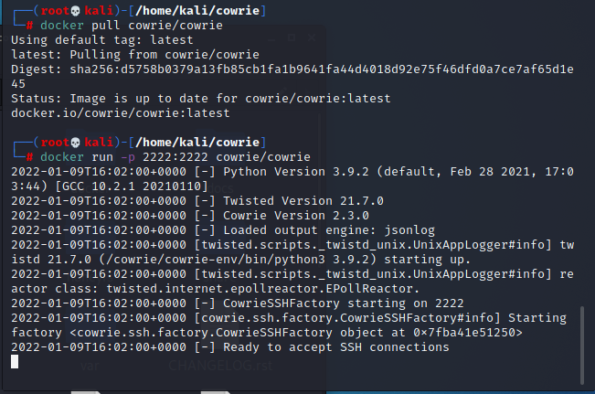

# 常见蜜罐体验和探索

## 实验目的

- 了解蜜罐的分类和基本原理
- 了解不同类型蜜罐的适用场合
- 掌握常见蜜罐的搭建和使用

## 实验环境

- 从 [paralax/awesome-honeypots](https://github.com/paralax/awesome-honeypots) 中选择 1 种低交互蜜罐和 1 种中等交互蜜罐进行搭建实验
  - 推荐 `SSH` 蜜罐

## 实验要求

- 记录蜜罐的详细搭建过程；
- 使用 `nmap` 扫描搭建好的蜜罐并分析扫描结果，同时分析「 `nmap` 扫描期间」蜜罐上记录得到的信息；
- 如何辨别当前目标是一个「蜜罐」？以自己搭建的蜜罐为例进行说明；
- （可选）总结常见的蜜罐识别和检测方法；
- （可选）基于 [canarytokens](https://github.com/thinkst/canarytokens) 搭建蜜信实验环境进行自由探索型实验；

## 实验过程

### 蜜罐安装

#### ssh-honeypot 低交互蜜罐

1. 从github获取ssh-honeypot

   ```bash
   git clone https://github.com/droberson/ssh-honeypot.git
   ```

   

2. 编辑配置文件修改ssh的端口号为60，不使用默认的22端口，22端口给蜜罐使用。（切换为root用户）

   ```bash
   sudo su
   vi /etc/ssh/sshd_config
   ```

   

3. 重启ssh服务，安装docker服务并启动 

   ```bash
   service ssh restart
   # 如果安装失败就 sudo apt-get update
   apt-get install docker docker-compose
   service docker start
   ```

   

4. 先安装 libssh 和 libjson-c，然后进入ssh-honeypot的文件夹安装ssh-honeypot

   ```bash
   #安装 libssh 和 libjson-c
   apt install libssh-dev libjson-c-dev
   #进入文件夹
   cd /home/kali/ssh-honeypot/
   #make命令的作用是进行编译
   make
   ssh-keygen -t rsa -f ./ssh-honeypot.rsa
   # 查看端口占用情况 lsof -i:22（端口号）
   # -l mylog.log选择日志文件，-u cowrie以cowrie身份运行，-d作为守护进程运行。
   # 如果还没安装cowrie就先去掉这个
   bin/ssh-honeypot -r ./ssh-honeypot.rsa -p 22 -l mylog.log -f my.pid -u cowrie -d
   ```

   

   

#### cowrie 中等交互蜜罐

1. 从github获取cowrie

   ```bash
   git clone https://github.com/cowrie/cowrie.git
   ```

   

2. 进入cowrie目录，安装镜像

   ```bash
   cd /home/kali/cowrie/
   docker pull cowrie/cowrie
   ```

   

3. 启动cowrie，在端口2222开启

   ```bash
   docker run -p 2222:2222 cowrie/cowrie
   ```

   

### 蜜罐扫描测试

蜜罐机的ip：


#### 扫描ssh-Honeypot蜜罐

1. 开启ssh-Honeypot

   

2. 攻击者尝试连接靶机（蜜罐），结果无法连接靶机（无论密码是否正确）。日志能记录攻击者行为 

   

3. 使用nmap扫描，发现端口为打开状态。并未发现有攻击者主机扫描端口操作的记录 

   

4. 查看日志。（我的kali的时间慢北京时间两小时）kali是虚拟机，攻击者主机是宿主机，可能因为这个导致显示的ssh登录为192.168.56.1，分别尝试ssh了两次，每次有三条记录。所以ssh-Honeypot只能记录ssh连接的ip地址，期间进行的nmap扫描则没有记录

   

#### 扫描cowrie蜜罐

1. 开启cowrie，用上面的方法

   

2. 攻击者尝试连接靶机（蜜罐），连接成功。并且kali蜜罐有回显，可以看到ip地址

   ```bash
   ssh root@192.168.56.102 -p 2222
   ```

   

   

3. 使用nmap扫描，发现端口为打开状态。可以发现有攻击者主机扫描端口操作的记录，可以看到多次扫描的记录，并且显示nmap

   

   

#### 思考题

如何辨别当前目标是一个「蜜罐」？以自己搭建的蜜罐为例进行说明

> 进行ssh连接，如果无论密码是否正确都不能连接，则可能是低交互蜜罐。如果连接上了，则进行一些命令测试，如果反馈的内容很奇怪或者报错了，那很可能是蜜罐。比如修改ssh配置文件报错


总结常见的蜜罐识别和检测方法

> * 低交互蜜罐：模拟服务和漏洞以便收集信息和恶意软件，但是攻击者无法和该系统进行交互，因此不能给攻击者提供完整的操作系统环境，可以通过使用一些复杂的命令和操作检测是不是处在蜜罐环境中。常用方法是产生一个网络请求。如```curl xxxxxx```然后检测服务器请求,如果没有说明已经进入了一个蜜罐.
> * 高交互蜜罐：攻击者可以几乎自由的访问系统资源直至系统重新清除恢复,主要采用虚拟主机进行部署。可以通过读取路由表,arp记录,系统日志等来分析它的网络交互。一个蜜罐通常是与其他计算机没有关联或被屏蔽的,所以如果读取到异常数据,基本可以认定是蜜罐。


## 某些问题的解决方法

#### ssh 链接远程服务器出现错误

原因：第一次ssh链接的时候会生成一个认证凭据，存储在客户端中的known_hosts，如果服务器地址重置or重新安装了，就会产生这个问题

> WARNING: REMOTE HOST IDENTIFICATION HAS CHANGED!

解决办法：

ssh-keygen -R 服务器地址

然后重新链接

## 参考资料

[kali 安装docker](https://www.cnblogs.com/lijingrong/p/13396884.html)

[在服务器上搭建简易的ssh蜜罐](https://blog.csdn.net/star92014/article/details/89260094)

[师哥或者师姐的报告](https://github.com/CUCCS/2020-ns-public-guoqiuchi/blob/a6bf7c3d4c9a45718e788cb7dd916c88bb007e9f/chap0x011/%E5%B8%B8%E8%A7%81%E8%9C%9C%E7%BD%90%E4%BD%93%E9%AA%8C%E5%92%8C%E6%8E%A2%E7%B4%A2.md)

