# 基于 VirtualBox 的网络攻防基础环境搭建

## 实验目的

- 掌握 VirtualBox 虚拟机的安装与使用；
- 掌握 VirtualBox 的虚拟网络类型和按需配置；
- 掌握 VirtualBox 的虚拟硬盘多重加载；

## 实验环境

以下是本次实验需要使用的网络节点说明和主要软件举例：

- VirtualBox 虚拟机
- 攻击者主机（Attacker）：Kali Rolling 2109.2
- 网关（Gateway, GW）：Debian Buster
- 靶机（Victim）：From Sqli to shell / xp-sp3 / Kali

## 实验要求

- 搭建满足如下拓扑图所示的虚拟机网络拓扑；

  

> 根据实验宿主机的性能条件，可以适度精简靶机数量

## 实验配置过程

- 虚拟硬盘配置成多重加载，效果如下图所示：

  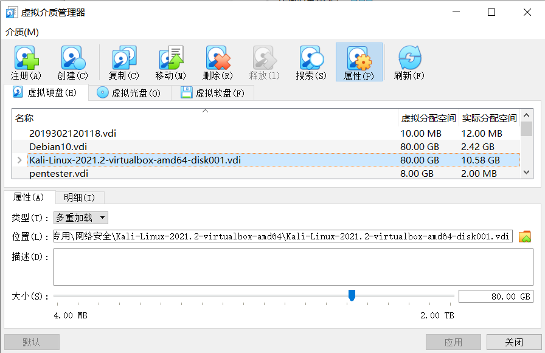


- 配置网关的网卡如下：

  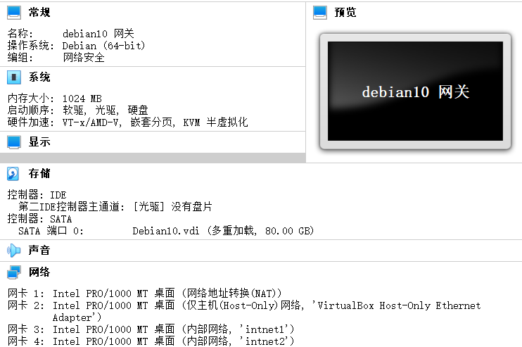

  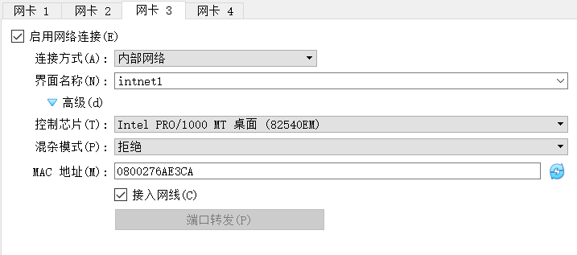


- debian默认不允许以root用户登录，必须以其他用户登录，su命令切换到root用户才可以操作

  用 vi 修改/etc/ssh/sshd_config文件

  ```bash
  #将以下配置改为：PermitRootLogin yes
  #PermitRootLogin prohibit-password
  ```

  然后重启ssh服务，即可

  ```bash
  service sshd restart
  ```

  成功用vs code 以root用户登录Debian：

  ```bash
  #Debian查看ip
  ip a
  ```

  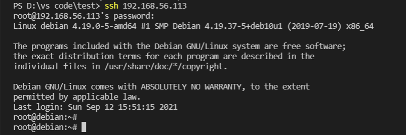

  网卡配置老师已经配好了（校园网下载的镜像文件）：

  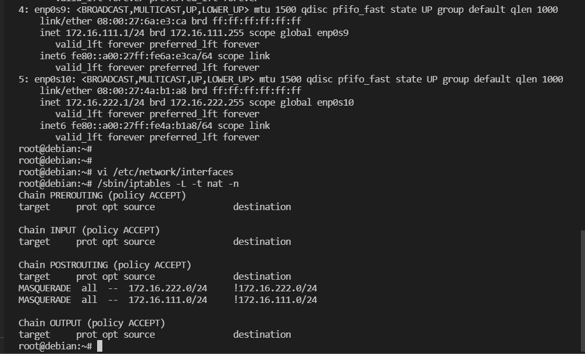


- 配置kali和win xp，选择内部网络，修改win xp的网卡：

  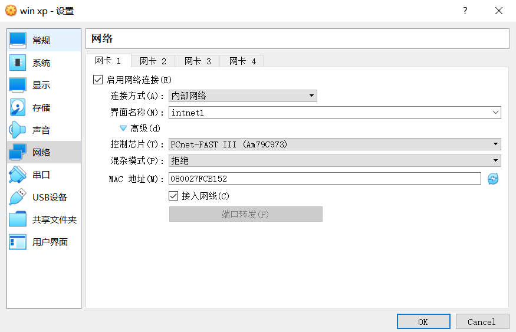

  win xp分配到的地址：

  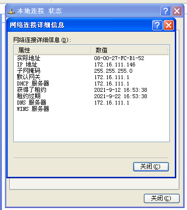

  win xp单向ping通网关：

  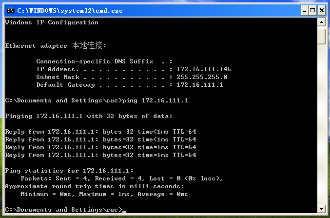

  关闭win xp防火墙后用Debian网关可以ping通win xp：

  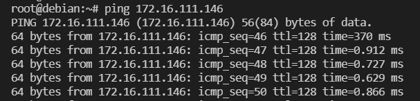

  配置Debian的dncp文件：

  ```bash
  #vi gw-enp0s9.conf
  interface=enp0s9
  dhcp-range=172.16.111.100,172.16.111.150,240h
  
  #vi gw-enp0s10.conf
  interface=enp0s10
  dhcp-range=172.16.222.100,172.16.222.150,240h
  ```

  vi /etc/dnsmasq.conf 老师已经配置好了：

  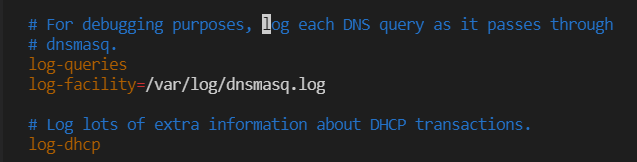

  重启服务，并开启开机自启：

  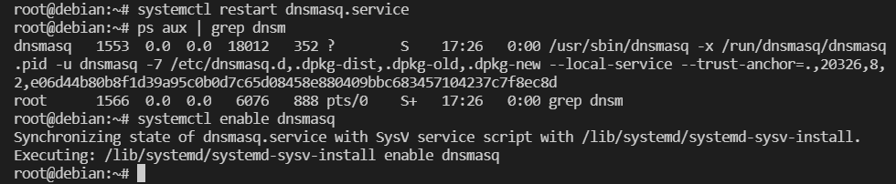

  kali成功ping通同网络的win xp：

  > kali分配到的ip：172.16.111.111

  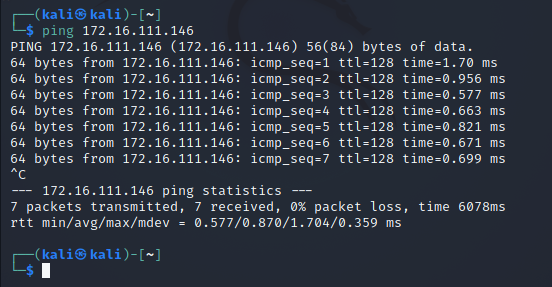

  kali也可以ping通网关：

  

  win xp可以ping通www.cucu.edu.cu：

  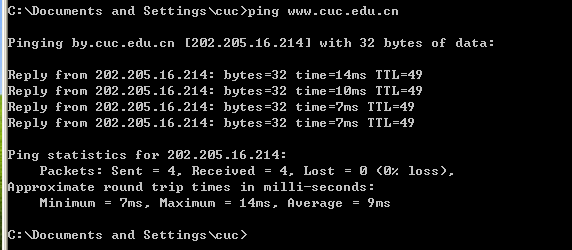

  查看Debian的日志，可以看到win xp的网络记录：

  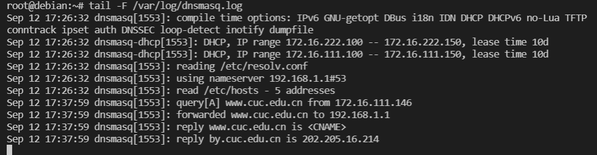

  

- 拔win xp的网线，改到intnet2网络，新ip分配立刻生效：

  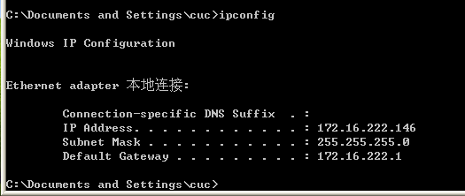


- 把Debian网关第一个网卡改为NAT 网络

  

- 新建攻击者主机attacker-kali，并设置网卡为NAT 网络

  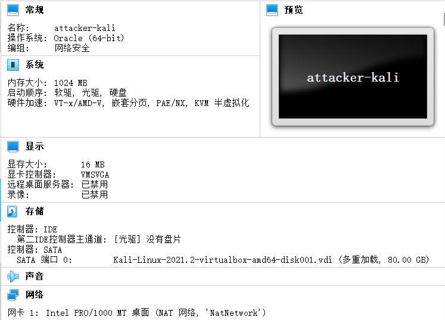

  

  攻击者分配到的ip地址：

  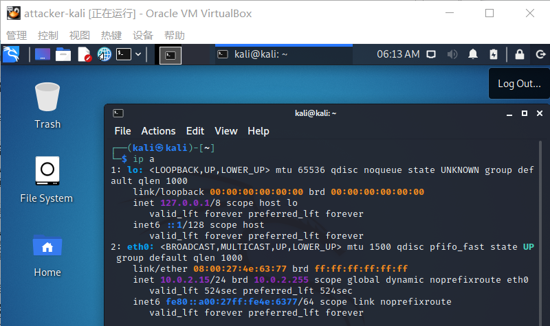

- 完成以下网络连通性测试；

  - 靶机可以直接访问攻击者主机

    win xp（intnet2）访问攻击者：

    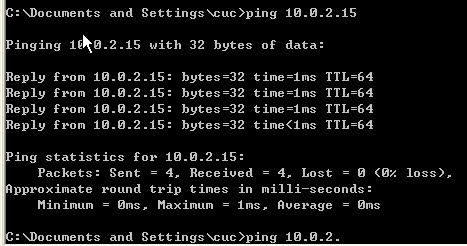

    kali（intnet1）访问攻击者：

    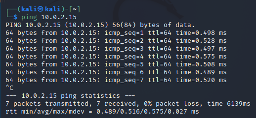

  - 攻击者主机无法直接访问靶机

    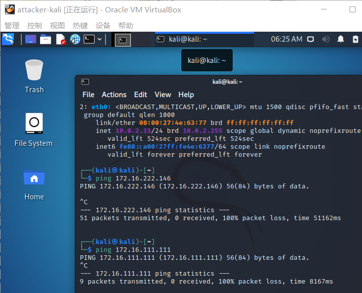

  - 网关可以直接访问攻击者主机和靶机

    

  - 靶机的所有对外上下行流量必须经过网关

    ```bash
    #安装服务
    apt update && apt install tmux
    apt install tcpdump
    #创建文件夹
    mkdir workspace
    cd workspace/
    #开始抓包
    tcpdump -i enp0s10 -n -w 20210912.pcap#保存的文件名
    #停止
    ^C
    #查看路径
    pwd
    
    #打开新终端，打开桌面
    cd .\Desktop\
    #将文件拷贝到宿主机
    scp root@192.168.56.113:/root/workspace/20210912.pcap ./
    ```

    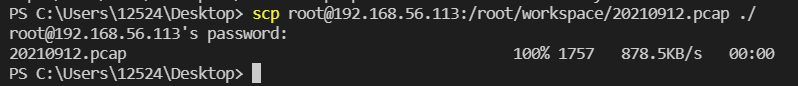

    用wireshark打开文件：

    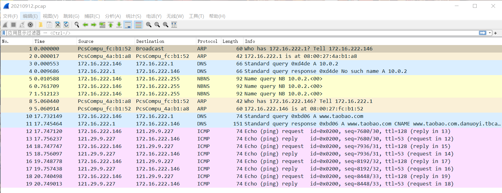

  - 所有节点均可以访问互联网

    win xp：

    

    kali：

    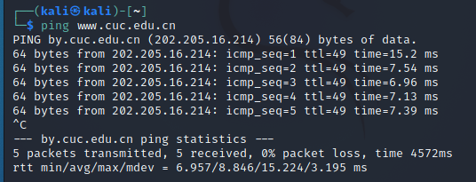

    攻击者：

    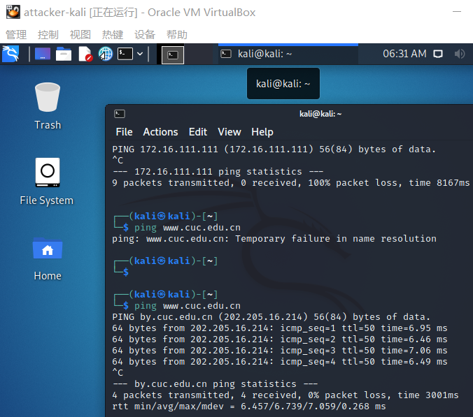

    网关：

    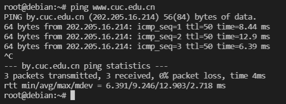

如果要多安装几台靶机，就用多重加载的镜像文件新建，将靶机放在intnet1或者intnet2即可，会自动分配地址

## 参考资料

[Virtualbox 多重加载设置方法](https://blog.csdn.net/jeanphorn/article/details/45056251)

[Debian设置允许root用户以ssh方式登录](https://www.cnblogs.com/liu-ke/p/14166097.html)

