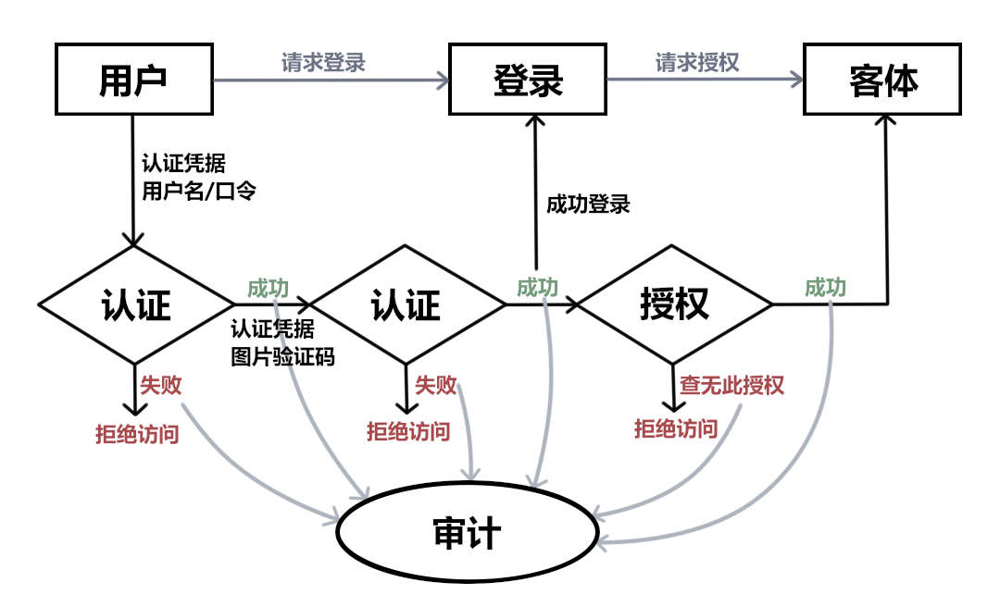

### 第二章课后作业

1. **生物特征身份认证方式有哪些？优缺点分析？应用场景举例。**

   指纹、虹膜、人脸、声纹等。

   优点：生物特征通常具有唯一的、可以测量或可自动识别和验证、遗传性或终身不变等特点，不易被冒充。

   缺点：双手长期手工作业的人的手指若有丝毫破损或干湿环境里、沾有异物则会导致指纹识别功能失效。人脸识别系统信息存储仍是以计算机能识别的语言为主，即数字或特定代码，安全性便要打折了。换个发型，画个妆，它也许无法识别了。虹膜识别的应用价格因其技术难度成正比，相比其他的识别技术，略显贵态。声纹识别对环境的要求非常高，在嘈杂的环境、混合说话下声纹不易获取；人的声音也会随着年龄、身体状况、年龄、情绪等的影响而变化；不同的麦克风和信道对识别性能有影响等。

   应用：指纹考勤，指纹解锁电脑和手机。人脸识别门禁系统。

2. **“找回口令功能”和“忘记密码”在访问授权机制中的意义？请尝试设计几种安全的“找回口令功能”，详细描述找回口令的用户具体操作过程。**

   保障授权主体的权益，防止授权主体因忘记认证密码导致无法进行认证和访问操作。

   用户点击“找回口令功能”，进入另一个界面，用注册时绑定的手机号或者邮箱进行身份认证，访问控制系统发送验证码到手机或者邮箱，用户输入验证码进行验证，通过认证后设置新口令或密码，然后用新口令登录账号进行身份认证。

3. **绘制用户使用用户名/口令+图片验证码方式录系统的流程图。考虑认证成功和失败两种场景，考虑授权成功和失败两种场景。**

   

4. **Windows XP / 7 中的访问控制策略有哪些？访问控制机制有哪些？**

   自主访问控制，强制访问控制，基于角色的访问控制。

   访问控制机制就是对访问控制策略的具体实现方式和过程。按照访问控制策略的 3 个基本面定义，实现访问控制就需要分别实现：身份认证、访问授权和审计。

5. **用权限三角形模型来理解并描述下 2 种威胁模型：提权、仿冒。**

   （ps：什么是权限三角形模型。）

   提权：提高自己在服务器中的权限，主要针对网站入侵过程中，当入侵某一网站时，通过各种漏洞提升WEBSHELL权限以夺得该服务器权限。

   仿冒：冒充授权用户身份，获取该用户的权限。

6. **试通过操作系统的访问控制机制来达到预防一种真实病毒的运行目的。**

   病毒欲执行某些需要权限的操作时会被拦截，操作系统要求其进行身份认证和访问授权，如果没有通过认证和授权，则无法执行这些操作，从而达到预防的目的。

7. **什么是 OAuth？**

   OAuth(开放授权)是一个开放标准。

   允许第三方网站在用户授权的前提下访问在用户在服务商那里存储的各种信息。

   而这种授权无需将用户提供用户名和密码提供给该第三方网站。

   OAuth允许用户提供一个令牌给第三方网站，一个令牌对应一个特定的第三方网站，同时该令牌只能在特定的时间内访问特定的资源。

8. **什么是 OpenID？**

   OpenID 的创建基于这样一个概念：可以通过URL来认证一个网站的唯一身份，同理，也可以让每人通过一个URL(一个OpenID身份就是一个URL)，在多个网站上进行登录，作为用户的身份认证。

   形象一点来说：URL是护照，OpenID服务器就是户口所在地。首先在一个OpenID服务器网站注册，获得一个URL，等于申请一个了“出入许可证”。然后可以直接使用这个URL来登录别的网站，也可以把这个URL加到自己的主页，让个人主页的URL具备OpenID URL的功能，就像是一个复印件。然后就可以拿这个URL到支持OpenID的网站去登录了。不需要每个网站都注册一遍，因为你的信息已经保存在OpenID服务器上，并获得那些网站的认可。好比是银行卡可以在银联内的多家银行取钱一样。不用担心自己的用户名被别人抢注，也不用怕忘记那许多用户名和密码。

9. **试用本章所学理论分析 0Auth 和 OpenID 的区别与联系。**

   OAuth关注的是authorization授权，即：“用户能做什么”；
    OpenID侧重的是authentication认证，即：“用户是谁”。

   OpenID是用来认证协议，OAuth是授权协议，二者是互补的。

10. **如何使用 OAuth 和 OpenID 相关技术实现单点登录（Single Sign On）？**

    首先在一个OpenID服务器网站A注册账户，获得一个URL。欲登录网址B，用OpenID实现身份认证并登录（跳转到网站A输入用户名密码，询问是否登录到网址B，用户确认，跳转回网址B，成功使用OpenID登录网站B），再利用OAuth即可在网站B获得网站A的用户信息和权限，从而实现SSO。

