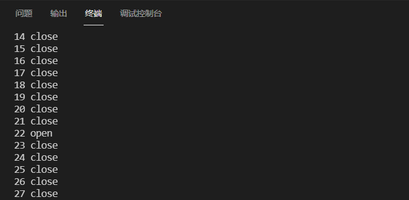

# 基于 Scapy 编写端口扫描器

### 实验目的

- 掌握网络扫描之端口状态探测的基本原理

### 实验环境

- python + [scapy](https://scapy.net/)

### 实验要求

- 禁止探测互联网上的 IP ，严格遵守网络安全相关法律法规
- 完成以下扫描技术的编程实现
  - TCP connect scan / TCP stealth scan
  - TCP Xmas scan / TCP fin scan / TCP null scan
  - UDP scan
- 上述每种扫描技术的实现测试均需要测试端口状态为：`开放`、`关闭` 和 `过滤` 状态时的程序执行结果
- 提供每一次扫描测试的抓包结果并分析与课本中的扫描方法原理是否相符？如果不同，试分析原因；
- 在实验报告中详细说明实验网络环境拓扑、被测试 IP 的端口状态是如何模拟的
- （可选）复刻 `nmap` 的上述扫描技术实现的命令行参数开关

### 命令基础

##### netstat命令参数

> -a (all)显示所有选项，默认不显示LISTEN相关
> -t (tcp)仅显示tcp相关选项
> -u (udp)仅显示udp相关选项
> -n 拒绝显示别名，能显示数字的全部转化成数字。
> -l 仅列出有在 Listen (监听) 的服務状态
>
> -p 显示建立相关链接的程序名
> -r 显示路由信息，路由表
> -e 显示扩展信息，例如uid等
> -s 按各个协议进行统计
> -c 每隔一个固定时间，执行该netstat命令。

##### 端口操作

```bash
#查看端口进程
sudo lsof -i :端口号

#开启/关闭服务（端口）
sudo service 服务名 stop(|start|restart)
#杀死进程
sudo kill PID （PID为端口服务进程号）
```

##### 防火墙操作

```bash
#安装防火墙
sudo apt-get install ufw

#检查下 UFW 是否已经在运行
sudo ufw status

#如果你发现状态是： inactive, 意思是没有被激活或不起作用。
#启用
sudo ufw enable
#禁用
sudo ufw disable

#在防火墙被激活后，你可以向里面添加你自己的规则。如果你想看看默认的规则，可以输入
sudo ufw status verbose
#默认是不允许所有外部访问连接的。如果你想远程连接你的机器，就得开放相应的端口。例如，你想用 ssh 来连接，下面是添加的命令
sudo ufw allow ssh
#开放/关闭端口
sudo ufw allow|deny [service]
#或者已知服务的端口
sudo ufw allow 22 
```

### 实验过程

受害者机的IP地址：192.168.56.106

#### TCP connect scan

如果返回SYN和ACK，则说明开放

如果返回RST，则说明关闭

1. 检查受害者机的端口情况

   

2. 运行`TCP_connect_scan.py`文件进行TCP连接扫描，可以得到22端口为**开放**状态：

   

3. 查看22端口详情，关闭对应的服务（关闭端口），再次进行端口扫描，显示端口为**关闭**状态：

   

   

4. 安装并开启防火墙，防火墙默认是不允许所有外部访问连接的。再次扫描，显示端口为**过滤**状态

   

5. 启动ssh服务，开放22端口，再次扫描，显示端口为**开启**状态，其他端口为**过滤**状态

   

   

#### TCP FIN scan

如果没有服务器端回应，则说明开放/过滤

如果返回一个RST数据包，则说明关闭

如果返回一个ICMP数据包（包含ICMP目标不可达错误类型3以及ICMP代码为1，2，3，9，10或13），则说明被过滤了，无法确定端口状态

1. 承接前面扫描的环境（防火墙默认状态开启，22端口关闭，ssh服务开启（端口过滤））。运行`TCP_FIN_scan.py`文件进行fin扫描，得到如下**过滤**或**开放**状态

   

   

2. 防火墙关闭，ssh服务关闭（端口关闭），再次扫描，得到**关闭**状态

   

   

3. 防火墙关闭，ssh服务开放（端口开放），再次扫描，得到**开放或过滤**状态

   

   

**问题**：有个问题，这种扫描有时候接收不到证明端口关闭的返回信息RST，导致客户端认为端口为开放或者过滤状态，有误差（不知道是不是脚本的问题，或者是网络的问题），在知乎看到如下说法：


#### UDP scan

如果回复了UDP数据包，则说明开放

如果返回了一个ICMP目标不可达的错误和代码3，则说明关闭

如果返回了一个ICMP目标不可达的错误且代码为1，2，9，10或13的数据包，则说明过滤

如果没有响应UDP请求，则说明开放/过滤

1. 防火墙默认状态开启，22端口关闭，ssh服务开启（端口过滤）。运行`UDP_scan.py`文件进行UDP扫描，得到如下**过滤**或**开放**状态（所有端口都是相同结果）

   

2. 防火墙关闭，ssh服务关闭（端口关闭），再次扫描，得到**关闭**状态。（但是还是存在为收到ICMP包的情况，这种情况会判断为开放/过滤）

   （此处打印的verbose=0，未显示详细信息）

   

3. 防火墙关闭，ssh服务开启（端口开放），再次扫描，得到**开启**状态。

   

**问题**：（未开启防火墙，22端口的ssh服务开启）当不使用verbose=0参数时，closed出现的很多。当使用verbose=0参数时，Open|Filtered出现的很多，不知道为什么。其他代码并未修改。

```python
udp_scan_resp = sr1(IP(dst=target)/UDP(dport=port),timeout=5,verbose=0)

udp_scan_resp = sr1(IP(dst=target)/UDP(dport=port),timeout=5)
```

#### 其他scan函数

[other_scan.py](other_scan.py)

忘记抓包了。。🙏感觉TCP connect 扫描的结果是最准确的，其他扫描多多少少有点问题，不知道是网络情况的问题。

### 参考资料

[python实现端口扫描器](https://www.cnblogs.com/LyShark/p/12391158.html#_label0) 这是我能搜到的、对各种扫描解释最清楚的代码了，但是似乎他的python版本有点老，可能语法有变化，所以才出现了上面提到的问题。感觉最关键的是要了解scapy各个函数和参数的意思

[ubuntu端口 扫描和开启](https://blog.csdn.net/weixin_33964094/article/details/91648366?utm_medium=distribute.pc_feed_404.none-task-blog-2~default~BlogCommendFromBaidu~default-2.control404&depth_1-utm_source=distribute.pc_feed_404.none-task-blog-2~default~BlogCommendFromBaidu~default-2.control40)

